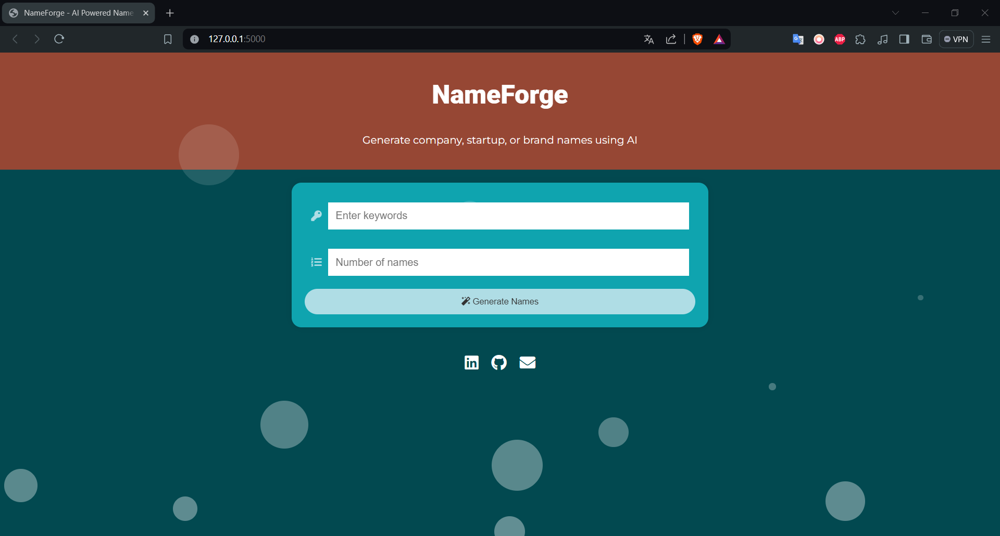

# NameForge - AI-Powered Name Generator

NameForge is an innovative application designed to generate unique and creative names for companies, brands, or startups based on user-provided keywords. Utilizing a fine-tuned GPT-2 model, NameForge offers suggestions that are not only unique but also relevant and inspiring. Due to time constraints and computational limitations, the model was fine-tuned on only 1,000 samples out of a potential 7 million available samples and for only 3 epochs. Additionally, the dataset used for training was not optimized for quality. As a result, while the application strives to provide useful suggestions, the performance and creativity of the generated names might not fully reach the potential of a more comprehensively trained model.




## Features

- Generate company or brand names based on specific keywords.
- AI-driven suggestions ensure high relevance and creativity.
- Simple and intuitive Flask-based web interface.

## Installation

### Prerequisites

Before installing NameForge, ensure you have the following installed on your system:
- Python 3.8 or above
- pip (Python package installer)

### Setup

1. **Clone the Repository:**
   ```bash
   git clone https://github.com/yourusername/NameForge.git
   cd NameForge
    ```

2. **Create a Virtual Environment (optional but recommended):**
   ```bash
   python -m venv nameforge-env
   source nameforge-env/bin/activate  # On Windows use `nameforge-env\Scripts\activate`
    ```

3. **Install Required Packages:**
   ```bash
   pip install -r requirements.txt
    ```

4. **Run the Flask Application:**
   ```bash
   python web_app/app.py
    ```

## Usage

To use NameForge:
1. Open a web browser and navigate to `http://127.0.0.1:5000/`.
2. Enter keywords related to the brand or company you want to name.
3. Specify the number of suggestions you desire.
4. Click `Generate Names` to receive a list of suggested names.

## Development

NameForge was developed using Flask and Python, with a GPT-2 model fine-tuned on a dataset of over 7 million company names. The model is hosted and run using PyTorch, with additional support from the Hugging Face `transformers` and `datasets` libraries.

## Contributing

Contributions to NameForge are welcome! Please feel free to fork the repository, make changes, and submit pull requests. You can also send feedback or feature requests by creating an issue in the repository.

## Contact

For support or to contact the developers:
- Email: [aminema1000@gmail.com](mailto:aminema1000@gmail.com)
- LinkedIn: [Amine Maazizi](https://www.linkedin.com/in/amine-maazizi-190266235/)
- GitHub: [amine-maazizi](https://github.com/amine-maazizi)

## License

NameForge is released under the MIT License. See the [LICENSE](LICENSE.md) file for more details.

---

I hope you find NameForge useful for your entrepreneurial endeavors and look forward to your contributions and feedback!
